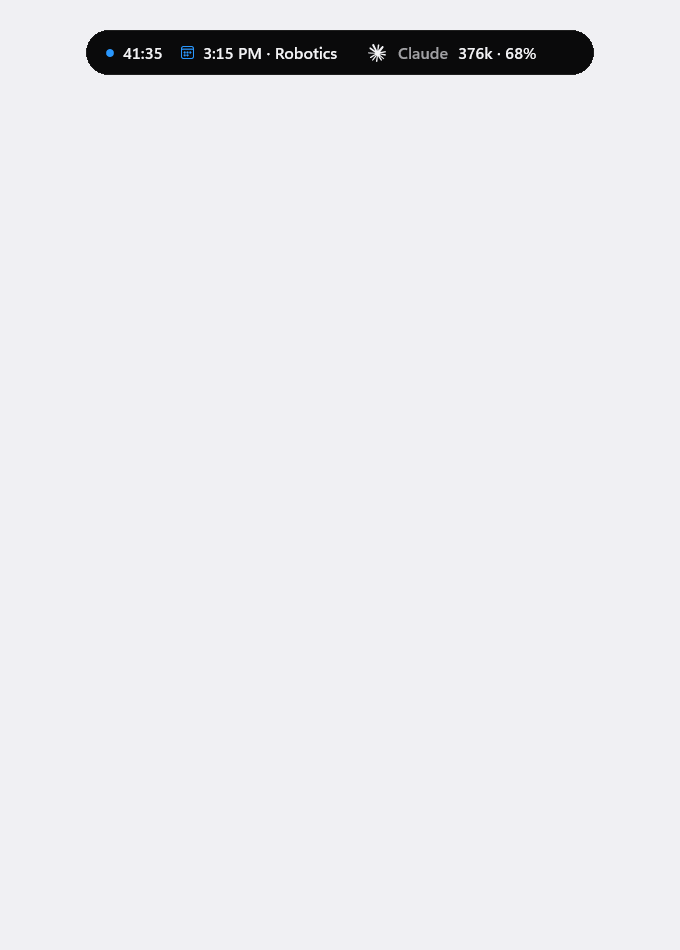
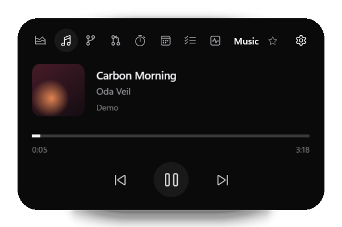
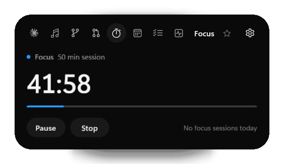
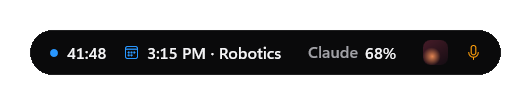
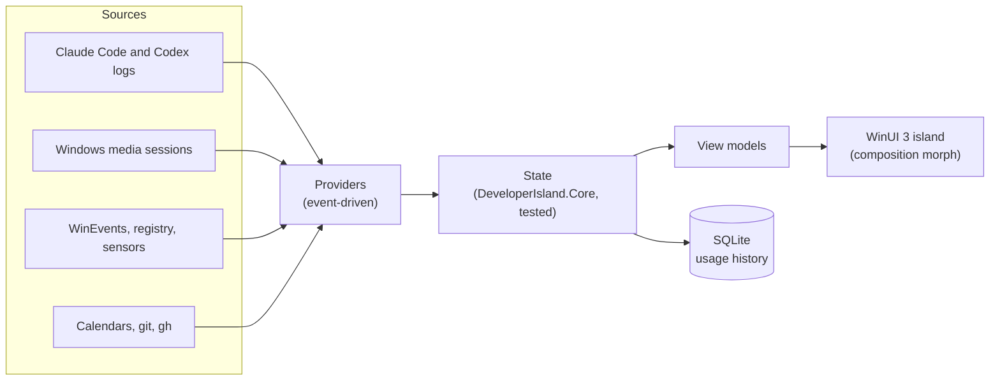

# Developer Island

> **The developer status bar Windows never had.**

Developer Island is a native, floating capsule at the top of your Windows screen. It shows your Claude Code and Codex usage, what's playing, your focus timer, your next meeting and your machine's health at a glance, and opens into a full view when you click it.

[](https://github.com/maximilian467/Developer-Island/actions/workflows/ci.yml)
[](https://github.com/maximilian467/Developer-Island/releases)
[](LICENSE)


<p align="center">
  
</p>

<p align="center"><sub>Demo mode with invented data, rendered by the app itself (<code>--snapshot</code>). In the live app, the states morph with springs.</sub></p>

## Why Developer Island?

AI coding tools spend tokens and plan limits where you can't see them, and the rest of a developer's day is scattered across a terminal, a media app, a calendar and Task Manager. macOS has the notch and the Dynamic Island idea; Windows has nothing in that spot. Developer Island puts the few things you glance at all day into one small capsule that stays out of your way: native, local-first and cheap enough to run all day.

## Features

### AI usage

- **Claude Code and Codex** usage from their local logs: today's fresh and processed tokens with a full breakdown (input, cache write, output, cache read), sessions and model.
- **Plan usage** where the tool reports it: Claude's 5-hour and weekly windows with reset times, and Codex's windows from its own logs. Never computed from token counts.
- A **26-week usage graph** with a tooltip per day, and an **estimated API equivalent** at public list prices (in the expanded view only).
- The compact capsule reads like `Claude 1.12M · 72%`.

### Media

- **Now playing** from any app that uses Windows media sessions (Spotify, Apple Music, browsers, Media Player): artwork, timeline, play and pause, previous and next, seeking where supported.

### Focus and productivity

- **Focus timer** with 25, 50 and 90 minute presets or a custom length; it survives restarts and keeps a daily history.
- **Calendar:** your next event and today's agenda from a private iCal link or an `.ics` file; within the hour before an event, the capsule shows it.
- **Tasks**, a small local to-do list, plus **Git** (branch, changes, push state of your current project) and **GitHub** (notifications, pull requests and CI through the GitHub CLI, read-only).
- **Favorites:** star a module and the compact capsule features it; several favorites take turns.

### System monitoring

- CPU, memory, GPU and battery with **60-second graphs** that turn orange or red under sustained load.
- **Temperatures and fan speeds** where the hardware exposes them (via LibreHardwareMonitor), each with its own thresholds. Nothing is estimated: a sensor that isn't there is not shown.

### Smart island

- **Compact, live activity and expanded** states with interruptible spring animations.
- **App-aware auto-hide:** while Chrome, Edge, Firefox or any app you list is in front, the island retracts into a 5 px notch in the screen edge (or hides), reliably even when you switch apps quickly.
- **Camera and microphone indicators** in every state, as tiny dots in the notch.
- **Anywhere you want it:** six anchors or a free position on any monitor, per-monitor DPI, a global shortcut (Ctrl + Alt + Space), tray menu and Start with Windows.

All details per module: [docs/MODULES.md](docs/MODULES.md).

## Preview

| Claude Code and Codex usage | Music |
|---|---|
|  |  |
| **System** | **Focus** |
|  |  |
| **Compact capsule** | **Settings** |
| <br><br> |  |

<sub>All screenshots show demo data.</sub>

## Privacy

Developer Island is **local-first**. It has no account, no telemetry and no cloud sync, and it does not upload your prompts or code.

- **Read locally:** Claude Code transcripts (`~/.claude/projects`) and Codex rollout files (`~/.codex/sessions`). Only usage metadata is extracted (token counts, model, timestamps, session IDs, working directory); prompt, message and code content is never stored, displayed or logged.
- **Stored locally** in `%LOCALAPPDATA%\DeveloperIsland`: a SQLite database with token counts and daily totals, settings, tasks, focus history and the last Claude plan percentages. Logs contain events and error types, never content, and are kept for 7 days.
- **Credentials:** private calendar links are kept in Windows Credential Manager. GitHub access goes through the GitHub CLI's own sign-in; Developer Island never sees a token.
- **Network:** only the calendar links you add, and the GitHub CLI's read-only requests while the GitHub module is on.
- **Camera and microphone:** only "in use or not" is read from Windows' own consent store; app names are never stored or shown.

Full details: [docs/PRIVACY.md](docs/PRIVACY.md) and [SECURITY.md](SECURITY.md).

## Installation

1. Download `DeveloperIsland-Setup-<version>.exe` from the [latest release](https://github.com/maximilian467/Developer-Island/releases/latest).
2. Run it. It installs per user into `%LOCALAPPDATA%\Programs`, without administrator rights and without a separate .NET runtime.
3. Launch **Developer Island** from the Start menu. It appears at the top center of your screen.

The installer is not code-signed yet, so Windows SmartScreen may ask you to confirm ("More info", then "Run anyway"). A portable zip is attached to each release as well: extract it completely and run `DeveloperIsland.exe`.

**Requirements:** Windows 11 x64 (tested). Windows 10 version 2004 or later is supported by the build but not yet tested. The Git module needs [Git for Windows](https://git-scm.com/download/win), the GitHub module the [GitHub CLI](https://cli.github.com/).

## Quick start

| Do this | And you get |
|---|---|
| Hover the capsule | A peek at the most relevant live information |
| Click it, or press **Ctrl + Alt + Space** | The expanded island; Esc or a click elsewhere closes it |
| Click the ☆ next to a module's name | That module is featured in the compact capsule |
| Drag the capsule | Move it; it snaps to the nearest anchor |
| Settings, Modules, **Claude plan usage**, Connect | Claude's 5-hour and weekly usage (from Claude Code terminal sessions) |
| Settings, Position, **Auto-hide in apps** | Choose which apps make the island step aside |

Want to look around first? Start **Developer Island (Demo)** from the Start menu, or run `DeveloperIsland.exe --demo`. Demo mode uses invented data only: it never reads your Claude or Codex usage, tasks or repositories, and its settings are kept separately.

## Configuration

Everything is set in the Settings window and applies immediately:

| Section | Settings |
|---|---|
| General | Start with Windows, always on top, launch hidden, keyboard shortcut |
| Position | Monitor, anchor, custom position; auto-hide in apps (notch or hide, only when maximized, app list) |
| Modules | Each module on or off and its order; Claude plan usage; Git repositories; calendars |
| Appearance | System or Dark for Settings (the island itself is always dark) |

API prices and the exchange rate for the API equivalent can be adjusted in `%LOCALAPPDATA%\DeveloperIsland\pricing.json` ([example](docs/PRIVACY.md)).

## Architecture



Data flows one way. `DeveloperIsland.Core` holds all logic without UI (the island state machine, auto-hide policy, parsers, aggregation) and is covered by unit tests; the WinUI app adds views, windowing and Windows integrations. A module that is turned off runs no watchers, timers or processes. Details: [docs/ARCHITECTURE.md](docs/ARCHITECTURE.md), [docs/PERFORMANCE.md](docs/PERFORMANCE.md).

## Tech stack

C# and .NET 10 · WinUI 3 and Windows App SDK 1.8 · SQLite (Microsoft.Data.Sqlite) · LibreHardwareMonitorLib · xUnit · Inno Setup

## Building from source

Requirements: the [.NET 10 SDK](https://dotnet.microsoft.com/download/dotnet/10.0) and Git; Visual Studio is optional.

```powershell
git clone https://github.com/maximilian467/Developer-Island.git
cd Developer-Island
dotnet test tests/DeveloperIsland.Tests     # build and run the tests
.\run.cmd -Demo                             # build and start with demo data (.\run.cmd for your real data)
```

Release build (tests, self-contained publish, portable zip, installer; the installer needs [Inno Setup 6](https://jrsoftware.org/isinfo.php)):

```powershell
powershell -ExecutionPolicy Bypass -File tools/build-release.ps1
```

More, including offscreen snapshots and the hardware report: [docs/DEVELOPMENT.md](docs/DEVELOPMENT.md).

## Accessibility

- Fully usable from the keyboard: the global shortcut opens the island with focus, Tab and the arrow keys move through it, Esc closes it and returns focus to where you were.
- Respects the Windows "Animation effects" setting.
- Per-monitor DPI aware; placement is recalculated when scaling or monitors change.
- Controls carry accessible names for screen readers; a full Narrator pass is still open.

## Known limitations

- **Hardware sensors vary by device.** CPU temperatures need administrator rights on many machines, and many laptops expose no fan speed to applications; such readings are hidden, not estimated.
- **Claude plan usage** arrives only from Claude Code terminal sessions (its status line); the VS Code extension does not provide it. Token usage works either way.
- **Codex limits** appear once Codex has recorded them in its logs.
- The installer is **not code-signed** yet. Only **x64** is built and tested.
- More in [docs/STATUS.md](docs/STATUS.md).

## Roadmap

- Code signing, a winget package and update notifications
- Account-based calendars (Outlook, Google) through the calendar provider interface
- More AI tools through the provider interface
- A layout per display, and ARM64 builds

No dates; priorities follow feedback.

## Contributing

Bug reports, ideas and pull requests are welcome. See [CONTRIBUTING.md](CONTRIBUTING.md) and the [changelog](CHANGELOG.md).

## Security

Please report vulnerabilities privately, as described in [SECURITY.md](SECURITY.md).

## License

[MIT](LICENSE) © 2026 Maximilian Köhlenbeck. Third-party components keep their own licenses: [THIRD_PARTY_NOTICES.md](THIRD_PARTY_NOTICES.md).

Claude Code and Codex are shown with the Claude and OpenAI marks (from Simple Icons, CC0). Claude is a trademark of Anthropic and OpenAI of OpenAI; Developer Island is not affiliated with or endorsed by either. The design follows an [Apple design analysis](docs/design/apple-design-analysis.md), the [Taste Skill](https://github.com/Leonxlnx/taste-skill) and the [Vercel Web Interface Guidelines](https://github.com/vercel-labs/web-interface-guidelines).
