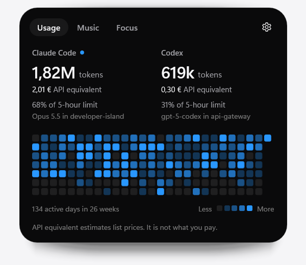
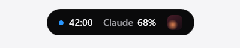
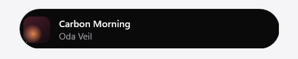
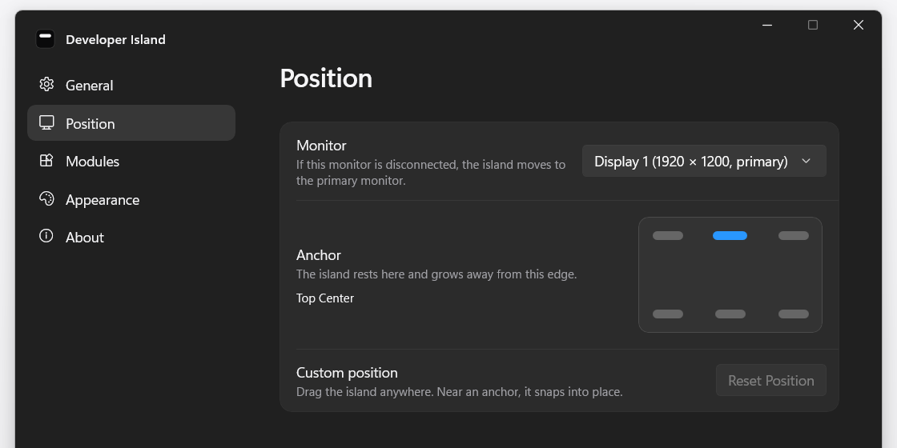

# Developer Island

**The developer status bar Windows never had.**

<p align="center">
  
</p>

Developer Island is a small capsule at the top of your screen. It shows your AI coding usage, what's playing and your focus timer. It grows briefly when something happens and opens into a full view when you click it. It is a native Windows app (C#, WinUI 3, Windows App SDK), built to stay out of your way and to run all day without you noticing it.

<p align="center">
  
  <br>
  
</p>

## Features

- **Three states.**
  - The **compact** capsule shows what matters right now.
  - A **live activity** (medium state) appears for song changes, focus sessions and AI events, or while you hover.
  - The **expanded** island opens on click.
- **Spring motion from the anchor.** The capsule morphs on the GPU compositor and grows away from the edge it rests on. Every animation can be interrupted and respects Windows "Animation effects".
- **Anywhere you want it.** It sits at Top Center by default. There are five more anchors, or you can drag it anywhere; near an anchor it snaps into place. The selected monitor, anchor and offset are saved. The island falls back to the primary monitor when that display is disconnected.
- **Out of the way.** The window region follows the active capsule and its shadow margin, leaving the rest of the desktop clickable. Hovering or dragging does not activate the island. The island steps aside while a fullscreen app is on its monitor.
- **Tray and autostart.** The notification-area menu offers Show, Hide, Start Focus, Settings and Quit. Start with Windows is a native per-user setting, with no scripts.
- **Keyboard.** Esc closes the island, and focus returns to where you were. Tab and the arrow keys move through the expanded view. Clicking the tray icon opens the island with keyboard focus inside.

### Claude Code

Developer Island reads usage metadata from Claude Code's local transcripts (`~/.claude/projects`, or `CLAUDE_CONFIG_DIR`). It shows:

- today's total tokens, calculated from input, output and cache metadata
- the sessions today
- the current model and project
- an activity indicator based on recent logs and available session metadata
- the **estimated API equivalent** in euros

Claude Code does not store plan-limit percentages locally, so the island shows tokens rather than guessing a percentage.

### Codex

Developer Island reads Codex rollout files (`~/.codex/sessions`, or `CODEX_HOME`) for:

- today's tokens, sessions, model and project
- the API equivalent
- the latest **primary rate-limit usage** recorded locally by Codex (usually a 5-hour window), when available

The island briefly shows an activity when Codex crosses 50, 75 or 90 % of that limit. Models without a known list price are reported as "partly priced" instead of being guessed.

### Usage history

A contribution-style graph covers 26 complete weeks plus the current week, with intensity based on your own quartiles. Hover a day, or move with the arrow keys, to read that day's Claude tokens, Codex tokens and API equivalent. A day's estimate is shown as unavailable if any model could not be priced. Daily totals are kept in a local SQLite database.

<p align="center">
  
  
</p>

### Music

Music works with anything that uses Windows media sessions (System Media Transport Controls), such as Spotify, Apple Music, browsers and Media Player. It needs no app-specific APIs and no accounts. It shows the track, artist, artwork and timeline, with Play and Pause, Previous and Next, and seeking when the player supports it. A song change shows a short live activity, which stays open while you hover it.

### Focus

- Presets of 25, 50 and 90 minutes, plus a custom length.
- Pause, resume and stop.
- A countdown in the capsule while a session runs.
- Focus minutes and sessions are stored per day, with today and the last 7 days shown.

### Settings

<p align="center">
  
</p>

| Section | Settings |
|---|---|
| General | Start with Windows, always on top, launch hidden |
| Position | Monitor, anchor, custom position |
| Modules | Claude Code, Codex, Music and Focus, each on or off |
| Appearance | System or Dark (the island itself is always dark) |

Changes apply immediately.

## Privacy

**Local-first. Your prompts never leave your device.**

- Developer Island makes **no network requests**, and it has no accounts, telemetry or cloud sync.
- It reads local JSONL files that can also contain conversation content, but extracts only usage and session metadata: token counts, model, timestamps, session IDs and working-directory information. It does not retain, display, log or upload prompt, message or code content.
- The local database (`%LOCALAPPDATA%\DeveloperIsland\usage.db`) contains token counts, model names, timestamps, session IDs, project folder names, daily totals and focus sessions.
- Logs (`%LOCALAPPDATA%\DeveloperIsland\logs`) contain app events and error types, never content. They are kept for 7 days.
- "API equivalent" is an **estimate** at public API list prices, converted to euros. If you use a subscription, it is not what you pay. You can adjust prices and the exchange rate in `%LOCALAPPDATA%\DeveloperIsland\pricing.json`, for example:

  ```json
  { "usdToEur": 0.86, "models": { "your-model-id": { "input": 2.0, "output": 8.0 } } }
  ```

  These are illustrative values, not a current price quote. Prices are USD per million tokens. The bundled catalog and exchange rate are static; overrides load on startup. Changing prices does not retroactively reprice every stored daily total.

## Installation

1. Build **`artifacts/DeveloperIsland-Setup.exe`** using the release command below, or download it when available on the [releases page](https://github.com/maximilian467/Developer-Island/releases).
2. Run it. It installs per user into `%LOCALAPPDATA%\Programs`, and needs no administrator rights, no Visual Studio and no .NET runtime.
3. Optionally, tick "Start Developer Island when I sign in".

The release script also creates `artifacts/DeveloperIsland-1.0.0-win-x64-portable.zip`. Extract the entire archive and run `DeveloperIsland.exe`.

Requirements: Windows 11 (recommended) or Windows 10 version 2004 or later, on x64.

> The installer is not code-signed yet, so Windows SmartScreen may ask for confirmation on first run.

To see every state without active Claude Code or Codex sessions, start the **Developer Island (Demo)** shortcut, or run `DeveloperIsland.exe --demo`. Demo usage and focus history live in memory, with preferences saved separately in `settings.demo.json`. Demo never writes your real usage history.

## Using it

| Action | Result |
|---|---|
| Hover the capsule | A peek at the most relevant live information |
| Click | Opens the expanded island |
| Esc, or click elsewhere | Closes the expanded island |
| Drag | Moves the island; it snaps to the nearest anchor when close |
| Tray icon | Opens the island with keyboard focus; right-click for the menu |
| `--settings=position` | On a fresh launch, opens Settings at a section (`general`, `position`, `modules`, `appearance`, `about`) |

## Development

Prerequisites: the [.NET 10 SDK](https://dotnet.microsoft.com/download). Visual Studio is optional; everything builds with the CLI.

```powershell
dotnet build src/DeveloperIsland -c Debug                      # build the app
dotnet test tests/DeveloperIsland.Tests                         # 132 tests
src/DeveloperIsland/bin/x64/Debug/net10.0-windows10.0.22621.0/win-x64/DeveloperIsland.exe --demo

powershell -ExecutionPolicy Bypass -File tools/build-release.ps1  # tests, publish, zip, installer
```

The release script needs [Inno Setup 6](https://jrsoftware.org/isinfo.php) (`winget install JRSoftware.InnoSetup`) for the installer step. Set `DI_LOG_DEBUG=1` to write debug-level logs.

The tests cover:

- usage aggregation and de-duplication
- malformed log records, persisted Codex limits, cursor upgrades and limit expiry
- cost calculation
- daily statistics, and incremental totals against a full recompute
- the focus timer
- settings persistence and corrupt-file recovery
- monitor placement and fallback
- provider error isolation
- SQLite persistence and migrations
- the island state machine
- display formatting

### Design

The UI follows three design sources, in this order:

1. The Apple design analysis in [`vorlage/DESIGN.md`](vorlage/DESIGN.md).
2. The [Taste Skill](https://github.com/Leonxlnx/taste-skill) (`design-taste-frontend`).
3. The [Vercel Web Interface Guidelines](https://github.com/vercel-labs/web-interface-guidelines).

They are merged into [`docs/design/DESIGN-PRINCIPLES.md`](docs/design/DESIGN-PRINCIPLES.md). The current review and remaining checks are recorded in [`docs/design/DESIGN-AUDIT.md`](docs/design/DESIGN-AUDIT.md). Screenshots above use demo data.

## Architecture

```
src/
  DeveloperIsland.Core/     platform-independent logic, covered by unit tests
    Providers/              Claude Code and Codex log providers, ProviderHost (error isolation)
    Usage/                  parsers, aggregation, incremental daily totals, history
    Pricing/                ModelPricingService (API equivalent, pricing.json overrides)
    Storage/                SQLite: usage events, daily usage, focus sessions, file cursors (migrations)
    Focus/  Island/         focus timer and history, island state machine
    Placement/  Settings/   monitor and anchor math, JSON settings
    Demo/                   in-memory demo data
  DeveloperIsland/          WinUI 3 app
    App/                    composition root (AppHost), entry point, single instance
    ViewModels/             snapshots turned into display state (the UI never parses files)
    UI/                     island window, compact, activity and expanded views, settings, motion
    Platform/               windowing, tray, autostart, media sessions, monitors, fullscreen detection
tests/DeveloperIsland.Tests
installer/                  Inno Setup script
tools/                      release build, asset generators, visual test helpers
```

Data flows one way: **Provider, then snapshot/model, then ViewModel, then UI.** Providers are event-driven (FileSystemWatcher plus per-file read cursors, with no polling). A provider that fails is reported as unavailable, and the rest of the island keeps working. See [`docs/ARCHITECTURE.md`](docs/ARCHITECTURE.md) and [`docs/PERFORMANCE.md`](docs/PERFORMANCE.md).

For verification results and V1 limitations, see [`docs/STATUS.md`](docs/STATUS.md). Running focus timers do not resume after quitting; one placement is saved, rather than a separate layout for each display. ARM64, Windows 10 and clean-machine installation still require independent validation.

## Roadmap

V1 deliberately covers Claude Code, Codex, Music and Focus. Ideas for later versions:

- Code-signed installer, a winget package and in-app update notifications
- More AI tools through the provider interface (Gemini CLI, GitHub Copilot usage)
- Opt-in plan-limit percentages for Claude Code, if they become available locally
- A focus history graph, focus sounds and do-not-disturb integration
- Build, CI and GitHub notifications as live activities
- ARM64 release builds

## Acknowledgements

Design principles:

- [Apple's interface design language](vorlage/DESIGN.md)
- [Taste Skill](https://github.com/Leonxlnx/taste-skill)
- [Vercel Web Interface Guidelines](https://github.com/vercel-labs/web-interface-guidelines)

Icons are Segoe Fluent Icons. Built with the Windows App SDK and WinUI 3.
