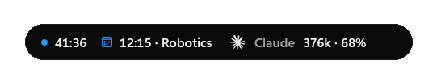
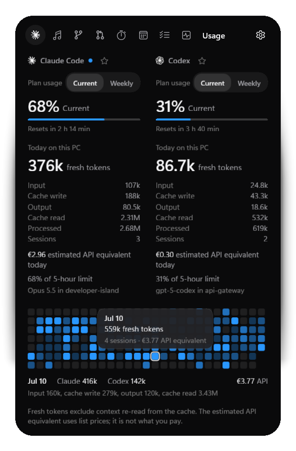
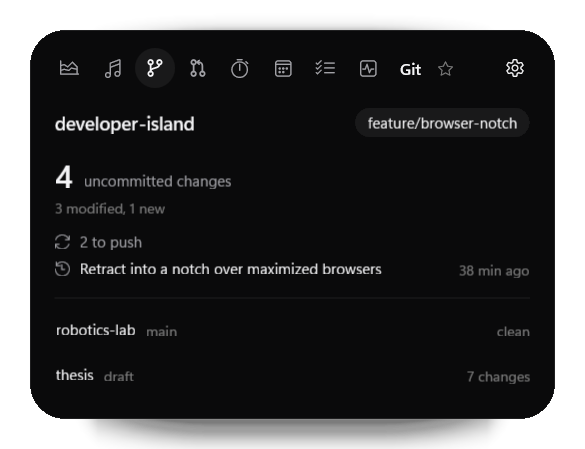
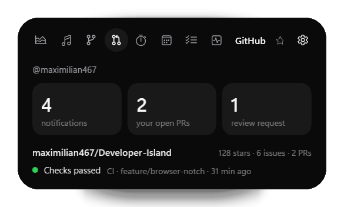
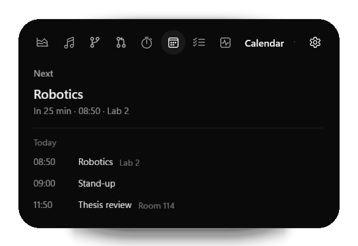
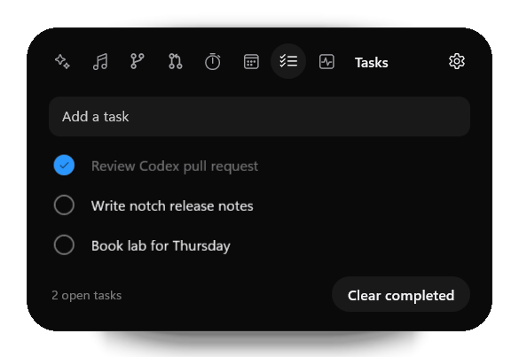
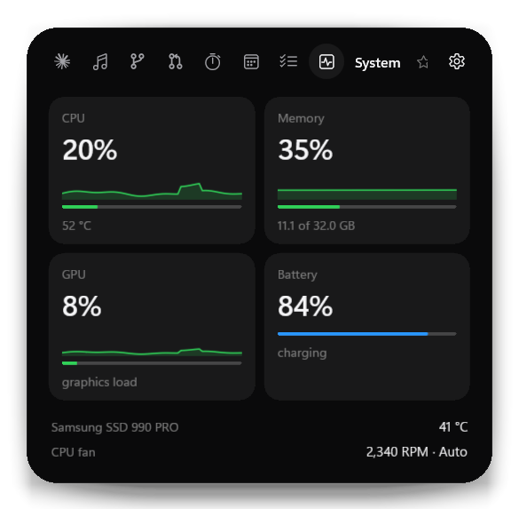
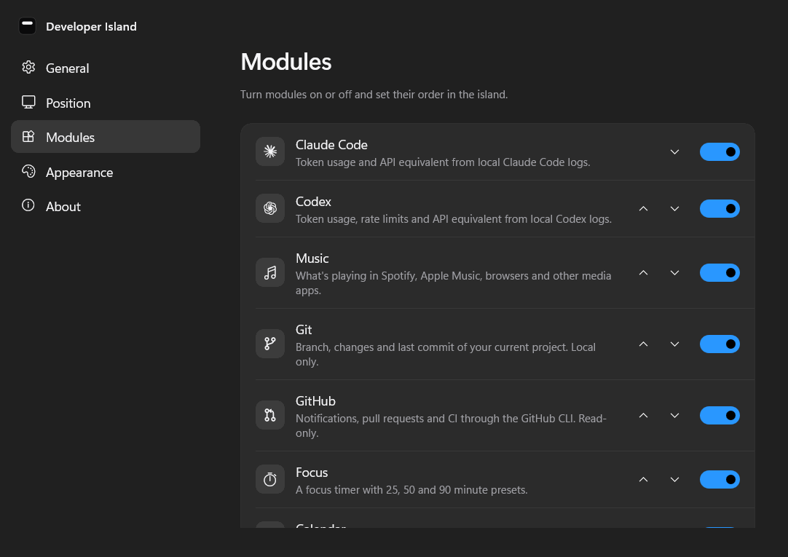
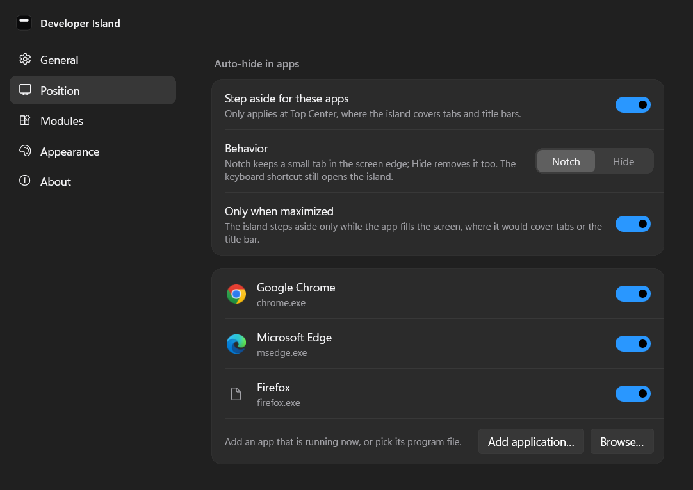

# Modules

What each module shows, where its data comes from and how it behaves. The [README](../README.md) has the overview; [ARCHITECTURE.md](ARCHITECTURE.md) explains how the modules are built.

## The island

- **Three states.**
  - The **compact** capsule shows what matters right now.
  - A **live activity** (medium state) appears for song changes, focus sessions, AI events and upcoming meetings, or while you hover.
  - The **expanded** island opens on click.
- **Spring motion from the anchor.** The capsule morphs on the GPU compositor and grows away from the edge it rests on. Every animation can be interrupted and respects Windows "Animation effects".
- **Your module, in the capsule.** Star any tab in the expanded island (the star sits next to Settings, in the same place on every tab; on Usage it stands for the enabled AI tools) and the compact island features it: "Claude 1.12M · 72%", the song, the focus countdown, "CPU 38% · 54°", "14:30 Robotics". Several favorites take turns every 7 seconds; without favorites the module you opened last is shown, and hovering or opening the island shows that module too (never a fixed default). Time-critical signals (focus, next event, system alert, failing CI) stay in front. Ticking values keep their width ("CPU 9%" and "CPU 100%" take the same room), so the capsule does not jitter; long song titles end in an ellipsis.
- **Camera and microphone.** While any app uses the microphone or the camera, a small orange microphone or green camera mark appears in the compact capsule, the live activity and the expanded island; in the notch it is only a tiny orange or green dot, and the notch keeps its size. It is a global signal, not a module, and never opens the island.
- **Hover that behaves.** A peek opens after a short, deliberate hover (about 280 ms). Hover is judged against the visible capsule, so it never sticks. A capsule that just grew under a resting mouse does not take your next click, and any click outside the expanded island closes it.
- **Auto-hide in apps.** A top-center island covers tabs and title bars. While an app you list is in front (Chrome, Edge and Firefox by default, or any app you add), the island retracts into a small notch in the screen edge (48 × 5 px). Hover it for 450 ms or click it to open. Choose per app, hide completely instead, or retract only while the app is maximized. This works the same whatever the island shows (Claude, Codex, Music, Focus, System, Calendar, or the open island). It reacts at once, also when you switch apps quickly: the app that is in front last always decides, and module updates (music, usage, system, focus, calendar) never bring the island back out. While a camera or microphone is in use, "hide completely" keeps the notch instead (same size) so its dot stays visible.
- **Anywhere you want it.** It sits at Top Center by default. There are five more anchors, or you can drag it anywhere; near an anchor it snaps into place. The monitor, anchor and offset are saved, and the island falls back to the primary monitor when that display is disconnected.
- **Out of the way.** The window region follows the capsule, leaving the rest of the desktop clickable. Hovering or dragging does not activate the island. It steps aside while a fullscreen app is on its monitor.
- **Keyboard.** **Ctrl + Alt + Space** opens or closes the island from anywhere; three other combinations are available if another app already uses it. Esc closes the island, and focus returns to where you were. Tab and the arrow keys move through the expanded view.
- **Tray and autostart.** The notification-area menu offers Show, Hide, Start Focus, New Task, Settings and Quit. Start with Windows is a native per-user setting, with no scripts.

  
   
  

## The modules

Nine modules, each of which can be turned off or reordered in Settings. The expanded island shows them as icon tabs, in your order, with the selected module's name beside them. A turned-off module does no work at all: no watchers, timers or processes.

Every module has the same four honest states: working; **empty** (nothing to show yet, with what to do about it); **unavailable** (a prerequisite is missing, such as the GitHub CLI); and **error** (reading failed, with a retry). The rest of the island always keeps working.

### Claude Code and Codex

Developer Island reads usage metadata from Claude Code's local transcripts (`~/.claude/projects`, or `CLAUDE_CONFIG_DIR`) and Codex rollout files (`~/.codex/sessions`, or `CODEX_HOME`).

Tokens are counted the way the providers bill them:

| Metric | Meaning |
|---|---|
| **Input** | New, uncached input |
| **Cache write** | Input written to the prompt cache |
| **Output** | Generated tokens |
| **Cache read** | Context re-read from the cache on every turn |
| **Fresh** | Input + cache write + output: the work of the day |
| **Processed** | Fresh + cache read: everything the model processed |

Each provider shows its **plan usage** first, when it is known:

- **Claude Code:** the current (5-hour) and weekly (7-day) windows with their reset times, as Claude Code reports them to its status line. Connect it once in Settings, Modules, "Claude plan usage": Developer Island becomes Claude Code's status line command, receives only those two percentages and reset times, shows nothing in the terminal, and leaves an existing status line of yours alone. Plan usage exists for Claude subscriptions only. Claude Code runs its status line only in terminal sessions, after a reply; the VS Code extension does not run it. Settings therefore tells "connected" apart from "receiving plan usage", and the island shows when the last figure was measured.
- **Codex:** the 5-hour and weekly windows from its own logs.
- A **Current / Weekly** switch picks the window. Without data the block says "Unavailable" and why. Percentages are never computed from token counts.

Below it, **Today on this PC** keeps the full local breakdown. The compact island shows today's **fresh** tokens and the plan percentage when known ("Claude 1.12M · 72%", or "Claude 1.12M tokens"); the estimated API equivalent appears only in the expanded view. The expanded view shows the full breakdown, and a tooltip on the figure lists every exact count. Hovering a day in the usage graph shows a small tooltip with its date, fresh tokens, sessions and API equivalent.

  

 Cache reads repeat the whole conversation context on every turn, so in long agent sessions they are often 80–90 % of processed tokens; counting them as "usage" made earlier numbers look inflated. The usage graph is shaded by fresh tokens too.

The **estimated API equivalent today** in euros prices every category at public list prices, including cache writes (1.25× or 2× input) and cache reads (0.1× input unless listed). If you use a subscription, it is not what you pay. Models without a known list price are reported as "partly priced" instead of being guessed. Codex also shows its latest primary rate-limit usage (usually a 5-hour window), with a live activity at 50, 75 and 90 %.

### Music

Works with anything that uses Windows media sessions (Spotify, Apple Music, browsers, Media Player and more), with no app-specific APIs and no accounts. It shows the track, artist, artwork and timeline, with Play and Pause, Previous and Next, and seeking when the player supports it. When several players are open, the one that is playing wins. When the player quits, the island clears instead of showing a stale track.

### Git

  

The repository of your latest Claude Code or Codex session, plus any you add in Settings: branch, uncommitted changes (staged, modified, new), commits to push or pull, and the last commit. Up to three other recent repositories are one click away. Developer Island never searches your disk: it only walks up from a session's folder to find its repository. Git runs only when you open the panel or when you commit, check out or fetch.

### GitHub

  

Notifications, your open pull requests, review requests, and the active repository's stars, issues and latest CI run. It uses the [GitHub CLI](https://cli.github.com/) and the account you signed in with (`gh auth login`); the app never sees, stores or asks for a token, and all requests are read-only. Without the CLI, the module explains how to connect. The compact island mentions GitHub only when CI fails.

### Calendar

  

Your next event and today's agenda. Add a calendar's private iCal link (kept in Windows Credential Manager, never in settings or logs) (Google, Outlook and iCloud offer one in their sharing settings) or an `.ics` file. Within the hour, the compact island shows the next event, for example **14:30 · Robotics**, and announces it once. Time zones, all-day events, recurring events (daily, weekly, monthly, yearly, with exceptions) and cancelled or moved occurrences are handled. Calendars are refreshed every 15 minutes. The architecture is provider-based, so account-based calendars can be added later without changing the module.

### Tasks

  

A small local to-do list. Type and press Enter to add a task; click the circle to complete it. Delete appears on hover; Alt + Up and Down (or the context menu) reorder tasks. **New Task…** in the tray menu opens the island with the cursor in the input.

### Focus

- Presets of 25, 50 and 90 minutes, plus a custom length; pause, resume and stop.
- A countdown in the capsule while a session runs.
- A running or paused session survives a restart. A session that ended while the app was closed is recorded as completed.
- Focus minutes and sessions are stored per day, with today and the last 7 days shown.

### System

  

CPU, memory, GPU and battery, each with its last 60 seconds as a quiet graph (green, orange or red by load: CPU and GPU from 60 % and 85 %, memory from 75 % and 90 %, averaged over five seconds), plus the temperatures and fans this device exposes (CPU and GPU temperatures in their tiles, storage, board and ACPI thermal zones and fan speeds as rows below; a temperature turns orange or red only above its own threshold, for example CPU 85 / 95 °C, SSD 60 / 70 °C). Fan speeds appear only when the hardware reports them: many laptops, including the development machine, expose no fan RPM to Windows applications, and no value is ever estimated. Hardware that does not exist, or that Windows does not expose without administrator rights, is not shown at all; the tiles re-flow. Readings come from Windows and [LibreHardwareMonitor](https://github.com/LibreHardwareMonitor/LibreHardwareMonitor), read-only. Manual fan control is not offered: no supported interface guarantees that fans return to firmware control if the app crashes. Run `DeveloperIsland.exe --system-report` to see what your device exposes.

The compact island speaks up only when something needs attention: a battery at 20 % or less that is not charging, or a CPU busy above 85 % for 15 seconds. Featured, it shows "CPU 38% · 54°" (or GPU or memory, whatever exists).

## Settings

  
  

| Section | Settings |
|---|---|
| General | Start with Windows, always on top, launch hidden, keyboard shortcut; Quit Developer Island (ends the app, its tray icon and all background work) |
| Position | Monitor, anchor, custom position; Auto-hide in apps (on or off, notch or hide, only when maximized, an app list with icons and Add application or Browse) |
| Modules | Every module on or off and in which order; Claude plan usage (connect or disconnect); Git repositories; calendars |
| Appearance | System or Dark (the island itself is always dark) |

Changes apply immediately.

## Using it

| Action | Result |
|---|---|
| Hover the capsule | A peek at the most relevant live information |
| Click | Opens the expanded island |
| Ctrl + Alt + Space | Opens or closes the island from anywhere |
| Esc, or click elsewhere | Closes the expanded island |
| Drag | Moves the island; it snaps to the nearest anchor when close |
| Tray icon | Opens the island with keyboard focus; right-click for the menu |
| `--settings=modules` | On a fresh launch, opens Settings at a section (`general`, `position`, `modules`, `appearance`, `about`) |
